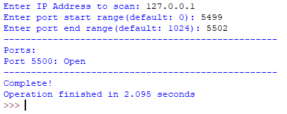

# py-portscan
A script in python that checks if ports are open from a given IP.
The script takes in an IP from the user and validates then takes in port 'start' range and port 'end' range.  
And lastly wait for it to check all of the ports.

That's it.

Preview of the program:  

